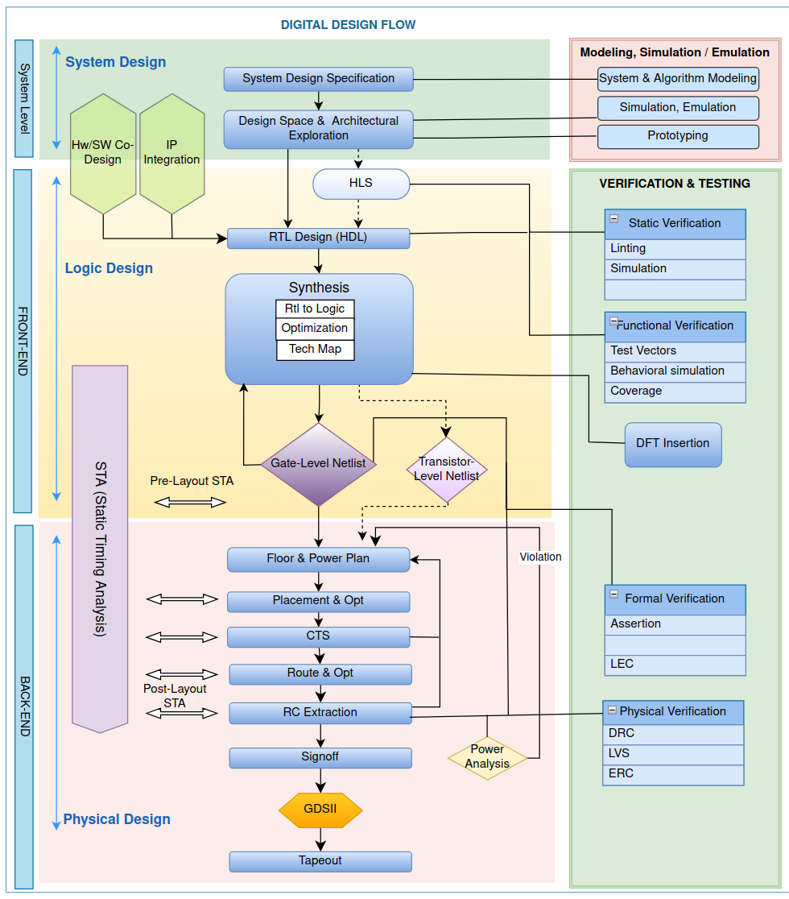
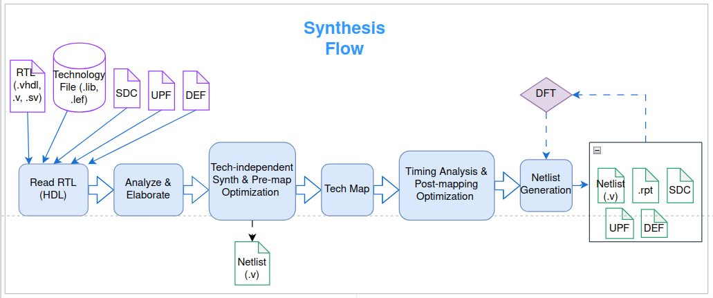
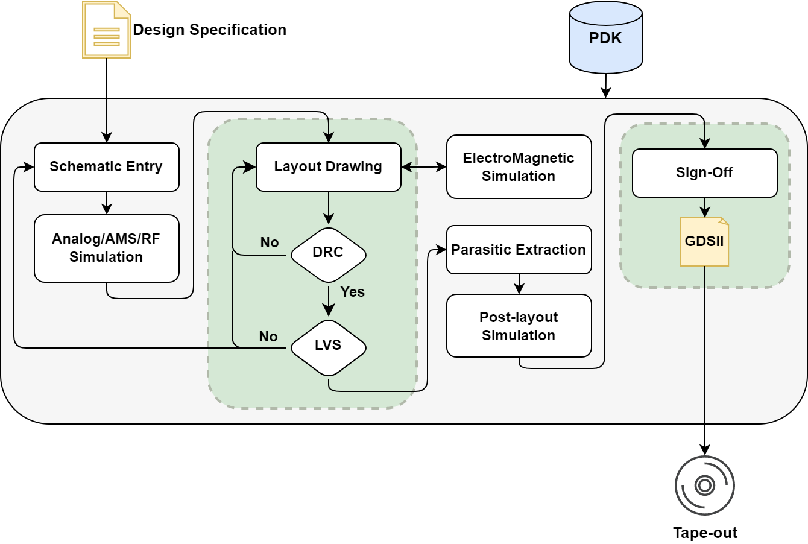

# Design Flows

Electronic Design Automation (EDA) refers to the use of advanced software and tools to design, simulate, and verify electronic systems such as integrated circuits (ICs), Application Specific Integrated Circuits (ASIC) and Systems-on-Chip (SoCs), including processors and peripherals. Since modern ASICs consist of billions of transistors, manual design is impractical, and automation tools are essential. Without EDA, the development of Very Large-Scale Integrated Circuits (VLSI) would be impossible. ASIC design involves creating complex electronic systems tailored for fabrication as specialized semiconductor devices, which are typically used in high volume products or applications with strict power, performance and size requirements.

This section describes typical flows for five domains of semiconductor design where EDA tools are involved: digital, photonics and analog, mixed-signal and radio frequency (RF) design. This section is then used as a base when open-source EDA design tools are introduced in later sections.

## Digital Design

Digital circuit design relies on EDA tools at every stage, from the transistor level to system-level architectural exploration. The design of a digital system often begins with system-level architectural exploration, where designers evaluate different architectures and performance tradeoffs before detailed implementation. This stage is especially critical for designing complex, high-performance computing systems such as graphics processors and server-class CPUs. Once the architecture is defined, typically a Hardware Description Language (HDL) is used to describe the hardware implementation. The implementation is then taken through a backend physical design flow. Through a sequence of design, verification, and optimization stages, this abstract description is gradually transformed into a physical layout. The final deliverable is a GDSII file, the industry standard format used by semiconductor foundries to manufacture chips.

Digital design process includes various steps like design conceptualization, chip optimization, logical and physical implementation, and design validation and verification. The overview of VLSI ASIC design flow is shown in the figure below.

Figure 1. Overview of Digital Design Flow.

In general, chip design is broadly divided into front-end design consisting of logic design, including RTL development, functional verification, and synthesis, and back-end design, which consists of physical implementation processes such as floorplan, placement, routing, static timing analysis and sign off. While some domains such as static timing analysis and verification often overlap, physical design tasks are generally classified as back-end. As technology continues to advance, achieving high-speed performance and energy efficiency has become increasingly important in ASIC design. To handle the growing complexity of modern ASICs and their implementation, a top-down design approach is commonly used.

### System Level Design

Beyond defining specifications, the objective of system level design is to explore design opportunities, identify architectural trade-offs, and make informed decisions to ensure the system satisfies both functional requirements (correctness, performance) and non-functional requirements (power consumption, silicon area, cost, programmability, safety, reliability). A critical activity in this phase is architectural exploration, where multiple architectural alternatives are modeled and evaluated to determine the most suitable implementation strategy before proceeding with Register Transfer Level (RTL) implementation. This helps optimize performance, reduce risk, and minimize rework in later stages of the flow. To manage the complexity of ASICs, system design typically uses various methods, modularity and hierarchical models, and progresses through several abstraction layers, which are described in subsequent sections.

#### System Specification

The development of a detailed and accurate specification establishes a solid foundation for complex ASIC design. The specification defines the chip’s intended behavior, functionality, and interfaces, along with the overall architecture at a high level. All requirements must be clearly specified to ensure correct implementation. These requirements guide the overall design process, and typically the architectural exploration in the next stage involves evaluating and modeling different design candidates at varying levels of accuracy. At this stage, the architecture for technical feasibility is analyzed, and the design challenges, operational constraints, and environmental conditions are thoroughly assessed. Architectural trade-offs are analyzed to balance performance, power, area, cost, and implementation complexity, and any required possible third-party IP blocks are identified.

#### Architectural Design 

At this stage, high-level decisions are made regarding system organization, functionality, performance objectives, and key architectural trade-offs. The architecture defines the required system components, clock frequencies, power constraints, and overall functional behavior. The system-level design is then decomposed into subsystems, functional blocks, and modules, with their interfaces and high-level data flow formally described, and memory hierarchies, clocking strategy, interfaces, communication protocol and data paths are designed. The design process forms a system-level view which includes the following:

- **Component requirements:** Identification and selection of compute elements such as CPUs, GPUs, accelerators, memory hierarchy, caches, interconnects, and peripheral blocks.

- **Clock frequencies:** Determination of operating frequencies for subsystems to achieve performance goals.

- **Power, performance and area (PPA):** Early estimation of power consumption, throughput, latency, and die area to ensure design feasibility.

- **Data flow:** Definition of how data moves between subsystems and functional blocks within the chip.

System Level Modeling, Simulation and Emulation

At the architectural design and exploration phase of ASIC design, division of tasks to be executed on hardware and software blocks is considered. System level modeling starts at higher abstraction with abstract modeling of behavior and platform which is iteratively refined in subsequent steps in top-down manner towards final implementation when required. Designs can be modeled at various abstraction levels such as Transaction Level Modeling (TLM) or Register Transfer Level (RTL). Model based approach begins with application first, enabling estimation of feasibility of implementation alternatives at an early stage of system design. Model based method increases reusability of components, reducing development time where HW and SW can be co-designed. System-level simulation, modelling, and exploration of the design are typically performed using high-level programming languages such as C++ or SystemC. Additionally, initial architecture can be modeled using HDL to represent the intended behavior of the ASIC.

**Transaction Level Modeling (TLM):** TLM is designed for early SoC exploration within the design flow, offering a lightweight development effort at higher abstraction level above RTL. In contrast, RTL implements a cycle-accurate HDL description for timing analysis resulting in slower simulation speeds and usually available only in later design stages. TLM representation of hardware blocks or IPs provides bit-accurate functionality, register-accurate interfaces, and system-level synchronization. Timed and untimed TLM address different design needs within a common modeling framework. Untimed TLM is used in early architectural exploration for software development, and functional verification, where fast simulation is crucial compared to timing accuracy. However, t**i**med TLM adds timing annotations to capture micro-architectural and communication behavior, enabling more accurate simulation for real-time systems and architectural evaluation. Key advantages of TLM include:

- Early software development in HW/SW co-design

- Architectural analysis

- Efficient functional verification

- Virtual software development

**SystemC:** SystemC is a system-level design and modeling language developed to accelerate complex HW/SW co-design while meeting system requirements and performance targets. It enables both hardware and software to be modeled within a single, unified language. SystemC is built on C++ and provides an object-oriented framework through a standardized set of classes for system modeling and simulation.

As design complexity grows, simulation time increases significantly, hence hardware-based debugging approaches such as emulation and (physical or virtual) prototyping are critical for large-scale and complex ASIC development. Emulation offers higher runtime performance and improved debugging efficiency, making it suitable for early RTL functional verification of complex SoCs. In emulation, HDL designs (eg. Verilog or VHDL) are compiled and mapped onto specialized hardware platforms which closely reflect real hardware behavior. This allows execution at much higher speeds, typically in hundreds of KHz or MHz range compared to functional simulations. Emulators combine specialized hardware and software components, providing an effective solution for high-speed design verification and debugging.

HW/SW Co-design

Hardware–software co-design refers to the integrated development of both hardware and software components to produce a complete system. This collaborative approach helps designers meet performance and functional requirements while improving design quality, shortening development cycles, reducing cost, and managing the growing complexity of modern SoC architectures. It is an iterative process that enables rapid early prototyping to validate specifications and timely feedback during the design cycle. With the increasing complexity of ASIC and SoC designs considering computer architecture and software compilation, HW/SW co-design becomes inherently challenging.

Transforming a system-level specification into a mixed HW/SW design involves system specification, communication synthesis, and architecture generation. Architecture generation yields a set of hardware and software modules and includes two tasks: virtual prototyping model which can be simulated, and architecture mapping, which produces an implementation or emulation of the original specification.

IP generation, Reuse and Integration

Intellectual Property (IP) are reusable design blocks that are either developed in-house or licensed from third-party vendors which can be integrated into designs. These IP blocks may range from simple peripheral controllers such as UART and SPI to complex subsystems including CPUs, GPUs, memory controllers, RAM macros, high-speed interfaces, and specialized accelerators. With increasing design complexity, scale, and shorter development cycles, the reliance on pre-verified and reusable IP has grown significantly. IP is typically delivered in multiple forms including Soft IP consisting of synthesizable RTL code, Hard IP that is delivered as fully placed and routed with process-specific GDSII or OASIS layout, and Firm IP which provides an optimized netlist but without a complete physical layout.

IP reuse offers clear advantages, including reduced time-to-market, lower development cost, minimized design risk, and access to specialized functionality. However, integrating heterogeneous IPs on a single chip introduces challenges related to interface compatibility, differing design methodologies, and strict design rules at advanced process nodes. To address these issues, established methodologies, best practices, and EDA assisted IP generation, and integration techniques are widely adopted.

IP integration involves selecting suitable IP based on system requirements, validating its functionality within the full-chip environment, adapting interfaces through wrappers if needed, configuring parameters, and performing physical integration, particularly for hard IP by placing and connecting the blocks within the layout.

### Logic Design and Synthesis (Front-End)

Once the system architecture and block-level planning are complete, the process continues with design implementation. This process starts with the front-end, where the HDL designs are generated and transformed from a high-level system description into a target technology mapped description. The hardware descriptions can be generated by high-level synthesis (HLS) tools, written manually in HDL, or integrated as pre-existing IP blocks.

#### High Level Synthesis (HLS)

A method of generating HDL designs from behavioral specifications is known as high-level synthesis. In HLS, the system’s behavior is described in high level languages such as C, C++, or Python which is easier to understand and write compared to low level HDL code in VHDL. This accelerates the design process and reduces the likelihood of errors. During HLS, high level description is analyzed then data flow and operations of the system are extracted and mapped to equivalent RTL that describes the system in terms of registers, operations and data flow.

In FPGA, HLS also enables the description and implementation of parallel hardware systems using high-level parallel programming models. Standards such as OpenCL provide an abstraction for expressing Single Program Multiple Data (SPMD) computation, in which a single behavioral description executes simultaneously across multiple data elements. By allowing parallel hardware to be specified in high-level languages rather than low-level HDL, this approach permits synthesis tools to compile the behavioral description into hardware structures that realize the intended parallelism while improving design productivity.

#### RTL Design (HDL Coding)

RTL design is a methodology for designing digital circuits that serves as an abstraction representing data flow between hardware registers and data processing or manipulation using arithmetic and logical operations. RTL design stage is where high-level specifications of a chip are translated into hardware implementation typically in the form of HDL such as VHDL, Verilog or SystemVerilog that describes the intended functionality of ASIC which includes modules, registers, combinational gates (AND, OR, NOR, NAND) as well as sequential logic (Flip-Flops, latches), Finite State Machine (FSM), Arithmetic Logic Block, Datapath and other elements.

At the RTL coding stage, it is essential to ensure that the HDL implementation correctly reflects the intended system behavior and satisfies all design requirements. This may include iteratively optimizing the code for PPA and ensuring that it remains modular and reusable. During and after the implementation, the RTL is verified, which will be discussed in more detail in later sections.

RTL partitioning is an effective technique used to break down the complexity of large VLSI/ASIC designs into smaller, manageable modules or subsystems. This approach not only simplifies the design process but also enhances design quality by enabling focused development on each individual component. In addition, partitioning supports parallelism, allowing different blocks to be designed and verified independently and concurrently. A design may be partitioned in several ways:

- **Functional partitioning,** based on major functional units such as processor cores, memory blocks, and I/O interfaces.

- **Hierarchical partitioning,** which organizes the design across multiple abstraction levels.

- **Physical partitioning,** which groups components according to physical characteristics, such as power domains or clock domains.

RTL Optimization

The goal of RTL optimization is to improve the design’s PPA by refining the RTL description to achieve greater efficiency while meeting the design requirements. This process requires an understanding of the design as well as the optimization techniques used to improve PPA. Typically this involves trade-offs of the different optimization targets which are:

1.  *Performance optimization* focuses on improving the operating speed of the design. This can be achieved through techniques such as pipelining, that divide design into various stages for parallel execution and simultaneous multiple operations.

2.  *Power optimization* aims to reduce the overall power consumption of the design. Techniques like clock gating accomplish this by disabling the clock signal for blocks that are not active, lowering switching activity of transistors and therefore reducing dynamic power.

3.  *Area optimization* focuses on minimizing the silicon footprint of the design. This can be achieved through methods such as resource sharing, where multiple functions reuse the same hardware resources, as well as constant propagation and other techniques that eliminate unnecessary logic.

#### Synthesis

After the RTL implementation has been verified, the design proceeds to synthesis. Synthesis is the process where EDA tools translate the high-level RTL description into a gate-level netlist composed of technology specific standard cells that can be physically implemented on silicon.

During synthesis, the required logic gates and flip-flops needed to implement the intended functionality are identified and then transformed into a logical representation, producing a netlist that defines the necessary interconnections. The synthesis tool uses RTL files, standard cell libraries containing timing and electrical data, constraint files, and physical abstracts such as .lef files that define cell dimensions and metal layers. It then transforms the behavioral or dataflow description into optimized physical standard cells, which are defined in a process design kit (PDK) containing the information required for fabrication on a target technology. Synthesis uses various optimization techniques to improve performance, power, and area efficiency. Information from the implementation process can be used iteratively, such as generating a placement for the standard cells and then rerunning the synthesis with the placement information, which can allow better decisions during synthesis. This method is known as physical-aware synthesis.

The synthesis flow consists of several stages, and its goals, categories, and typical inputs/outputs can be summarized as follows:

Figure 2. RTL Synthesis Flow.

**Goal of synthesis**

- Logic optimization with good QoR (Quality of Results)

- Scan Insertion (DFT)

- Netlist generation and verification with LEC (logic equivalence check)

**Synthesis inputs**

- **Liberty-timing library (.lib or .db):** Describe logical function, timing, power and area of standard cells including PVT (Process, Voltage, Temperature) characterization.

- **Physical library (.lef):** Library exchange format contains physical information like height, width of metal, via, pin, standard cells and macros.

- **SDC:** Timing constraints.

- **RTL:** Code in HDL format.

- **DEF:** Contains placement information of macros, pre-placed cells, IO ports, block size and blockages mainly used for physical-aware synthesis.

- **UPF:** Provide information on power intent of design including power domain, level shifter, isolation cell and retention registers.

**Synthesis output**

- Netlist

- UPF (updated)

- SDC (updated)

- DEF (updated)

- Reports

Synthesis Flow

Synthesis flow typically includes following steps:

**Analysis and elaboration:** During elaboration, the tool verifies that the design is well-defined and unique, resolving high-level constructs for any unresolved references, such as hierarchical module instantiation, blocks generation, parameter overrides, and loop unrolling. After elaboration, timing loops are checked, and the synthesis tool builds a generic, technology-independent logic-level netlist without mapping it to actual standard cells.

**Technology-independent synthesis and (pre-mapping) optimization:** Prior to technology mapping, synthesis tools perform various high-level, technology independent optimizations that include constant propagation, eliminating dead code or unused modules, Boolean simplification, finite state machine (FSM) encoding and extraction and retiming.

**Technology mapping:** At this stage, elements such as gates and flip-flops are mapped to actual standard cells from the .lib file. Mapping involves selecting the most suitable cells for implementing required logic functions while considering factors like timing, area and power consumption. It includes various processes like decomposition which breaks complex expressions into smaller gates supported by the target PDK, cell selection based on appropriate drive strength to meet delay, area and power targets, buffer insertion to handle long wires or high fanout nets and MUX inference to implement conditional logic as optimized multiplexer structures.

**Timing analysis & post-mapping optimization:** Synthesis tools further refine the design through timing analysis and optimization techniques to ensure it meets the required constraints. This involves evaluating signal and interconnect delays along with other factors that affect overall performance. During this stage, the design is optimized according to specifications through methods such as register retiming to improve pipeline stage placement, cell resizing by replacing cells with higher or lower drive strengths to meet timing requirements, clock gating to reduce power consumption, gate duplication to manage high fan-out loads, and rebuffering to adjust or replace buffers based on updated net delays.

**Netlist generation:** Finally, synthesis generates a mapped and optimized gate-level netlist that will be used in physical design. The synthesized netlist not only represents the logic implementation but also includes attributes that influence how the design meets timing, area, and power goals. At the end of the synthesis process, additional reports and updated constraint files are also produced, depending on the synthesis tools and configurations.

### Verification, Testing, Power and Timing Analysis

In the physical design of complex ASICs, simulation, verification, power, and timing analysis are critical activities that ensure a design meets its functional, performance and reliability requirements before manufacturing. Verification consumes a significant portion of chip design cycle, and it can be performed in various stages of the design flow including front-end and backend flow consisting of logic as well as physical design. Functional simulation and verification confirm correctness of logic and interfaces, while static timing analysis (STA) validates that timing constraints are met across operating corners. Power analysis evaluates dynamic and leakage power to ensure thermal and energy consumption are satisfied. Traditionally, many of these checks, along with physical verification such as DRC, LVS, and ERC, are performed during late-stage signoff, once the layout is relatively complete and prepared for tape-out.

Left-Shifting

As the size and complexity of modern SoCs increases, relying primarily on end-of-flow verification has become increasingly inefficient. Late discovery of timing, power, or reliability issues often leads to costly design iterations, extended schedules, and increased risk at tape-out. To address these challenges, new concepts are being adopted as a left-shift verification approach in the ASIC design flow. Left-shift moves selected verification, power, and timing analyses into earlier stages of the design flow, where issues can be identified and corrected more quickly and with lower impact. Rather than applying full signoff checks on incomplete layouts, left-shift emphasizes lightweight, targeted pre-simulation and pre-layout analyses that focus on critical risks such as power domain errors, clock and signal crossings, leakage paths, and interface mismatches. This strategy improves productivity, reduces late-stage rework, and enhances overall design quality while maintaining manageable verification complexity.

Modern verification combines multiple methodologies and abstraction levels to comprehensively validate a design.

Behavioral Simulation

Behavioral simulation uses high-level models such as behavioral RTL, SystemC, or C/TLM models to validate design functionality early in the flow. It focuses on algorithm correctness, data flow, and architectural intent, providing fast simulation for design exploration.

Functional verification

Following RTL design, functional verification ensures that the RTL design performs according to specifications focusing on logic correctness, data flow, and module interactions. This involves code analysis (linting), RTL simulation, and coverage analysis. This is typically achieved through simulation-based methods, where testbenches apply input stimuli and observe responses, mimicking hardware behavior. Functional verification is essential for detecting logic errors, interface mismatches, and integration issues. It includes various steps and methodologies:

**Linting:** Linting is used to verify RTL design correctness. Linting tools examine the RTL code for common coding mistakes, compliance with coding standards, and potential synthesis or timing issues. By identifying these problems early in the design process, linting helps improve RTL quality.

**Assertion-based verification:** RTL code assertions are used to automatically monitor and validate specific design properties, such as protocol compliance, signal integrity, and corner-case behaviors. Assertions complement simulation by providing automatic checks that reduce manual debugging effort.

**Coverage-driven verification:** Coverage analysis measures how much of the design has been exercised during verification. Functional and code coverage metrics identify untested paths or scenarios, guiding additional test creation to achieve verification completeness.

Verification spans multiple abstraction levels:

- **Behavioral models** for early functional and architectural validation.

- **RTL models** for cycle-accurate functional and interface verification using testbenches, assertions, and coverage metrics.

- **Gate-level models** for pre-layout and post-layout verification, including timing, power, and functional equivalence checks.

Verification frameworks include:

- **UVM (Universal Verification Methodology):** Standardized SystemVerilog-based methodology for building reusable and modular verification environments.

- **OVM (Open Verification Methodology):** Predecessor to UVM, also supports modular and reusable verification components.

- **Cocotb:** Python-based verification environment that interacts with RTL simulators.

Formal Verification

Formal verification is a method that proves the correctness of a hardware design mathematically, rather than relying solely on simulation. It detects design errors which may not appear in simulation that verifies critical properties like protocol compliance, timing constraints, correct data flow and control logic.

Design for Test (DFT)

DFT insertion is performed after synthesis and prior to physical design. During this stage, hardware structures such as scan chains, compression logic, and MBIST/LBIST modules, JTAG macros, and boundary scan cells are added to the gate-level netlist to enable efficient testing of the manufactured chip. Following DFT insertion, the design undergoes DFT verification, which includes:

- **Scan chain:** Ensures proper connectivity of scan paths.

- **Automatic test pattern generation (ATPG) and fault simulation:** Generates and validates test patterns.

- **Coverage analysis:** Assesses the quality and completeness of testability.

- **Timing and area validation:** Confirms that added DFT logic does not violate constraints.

- **MBIST/LBIST verification:** Tests memory blocks and logic structures integrated with self-test capabilities.

- **JTAG Macro:** A standard interface (Test Access Port) used to control DFT features, including scan chains, compression logic, and memory self-tests.

- **Boundary scan:** Ensures that boundary scan cells are correctly inserted between each I/O pin and internal logic, enabling observation and control of chip inputs and outputs for board-level testing.

- **Scan-chain compression:** Ensures compression logic works correctly to reduce test data and time, with an optional smart scan to minimize pin usage.

Physical Verification

**Logic equivalence checking (LEC):** LEC is a formal verification technique used in the physical verification stage to ensure that the physical layout of a design after post-synthesis, DFT insertion or post-layout netlist is functionally equivalent to its logical schematic or RTL description. This step is crucial to guarantee that no unintended changes or errors were introduced during synthesis, placement, or routing. It ensures that the netlist from the physical layout matches the logical behavior of the original RTL or schematic. It detects netlist mismatches, missing or extra cells, and connectivity errors. LEC focuses solely on logical equivalence, independent of timing, and can automatically verify large designs.

Other methods of physical verification such as DRC, ERC, DFM, and timing and power analysis are described in the backend design flow section.

Timing Verification

Timing verification ensures that an ASIC design meets all specified timing requirements. Primary approaches for timing verifications are dynamic simulation and STA:

**Dynamic simulation:** Dynamic simulation is performed at the transistor or gate level and captures the effects of gate delays and parasitic on the design’s functionality and performance, supporting a wide range of design styles.

**Static Timing Analysis (STA):** STA is a critical post-synthesis and back-end verification technique that checks whether a design meets its timing constraints, such as setup and hold requirements. STA analyzes the design timing paths to verify that signals can propagate between registers within one clock cycle without violating timing constraints. It is used after synthesis and during post-placement and routing to ensure timing correctness. The key functionalities of STA include:

- Calculating propagation delays along critical paths, including slacks.

- Detecting setup and hold time violations.

- Evaluating clock skew and jitter effects

- Checking multicycle and feasible paths

Power Analysis

Power and energy have become critical considerations in digital hardware design. Power is regarded as equally important as silicon area and performance. Most practical designs consider both delay and energy, with power dissipation arising from two main sources:

**Dynamic power** is caused by switching activity when transistors are turned on and off during change in signals. Dynamic power consumption increases with increasing frequency.

**Static power** is caused by leakage currents that pass-through transistors even when they are idle and become more significant with smaller technology nodes.

In ASIC design, reducing switching activity is a key approach to lower dynamic power consumption. Techniques include:

- **Clock gating:** Disables the clock in inactive blocks, directly reducing dynamic power.

- **Glitch reduction:** Minimizes unnecessary transitions caused by unbalanced path delay.

- **Demultiplexing / parallelization**: Reduces extra transitions by avoiding excessive hardware multiplexing, though it may increase area.

- **Multi-voltage domains:** Various sections of the chip operate at different voltages based on their performance requirements.

### Physical Design (Back-End)

Physical design, also referred to as the back-end process, is the stage where the actual layout of the ASIC is generated. During this phase, the synthesized gate-level netlist is transformed into the final GDSII file for fabrication and undergoes signoff checks to ensure the design meets all specifications. The back-end ASIC development flow is further sub-divided into the following sections.

Floorplanning

Floorplanning establishes initial high level chip layout by dividing the die into physical partitions, shaping them to meet area and data/control flow requirements, and roughly assigning pins and ports for later placement and routing. It:

- Defines core area, I/O placement and space for buffers.

- Allocates space for macros, memories, and standard cells.

- Plans clock tree and power distribution.

Placement

Placement positions standard cells, macros, and IP blocks within the floorplan to minimize wire length, reduce congestion, and optimize timing and power. No actual routing is done, but global routing estimates wire length and congestion. Modern placement engines can use switching activity (SAIF/VCD) information to optimize placement for lower dynamic power.

Power planning

Power planning involves creating power grids and incorporating decoupling capacitors to maintain stable voltage during switching. Effective power distribution is essential to prevent IR drops and electromigration (gradual damage to wires from current flow).

Clock tree synthesis (CTS)

Clock Tree Synthesis distributes the clock across the chip with minimal skew and latency using buffers. Its goals are optimal clock timing and reduced skew, and since clocks toggle frequently, the clock tree can in some designs account for over 75% of dynamic power. Its main task is to generate clock buffers and clock routing, and balance clock arrival times at flip-flops.

Routing

Routing connects all cells and macros according to the netlist across multiple metal layers using detailed routing algorithms. Global routing defines rough paths, while detailed routing assigns precise metal tracks, optimizing timing, signal integrity, and minimal DRC violations. Multiple iterations ensure efficient, legal routes with minimal detours.

Physical layout verification

After completing the layout, tools verify that the design is ready for fabrication. While logic verification ensures correct functionality, physical verification ensures layout is correct. Physical verification involves checking design for manufacturability, reliability, and electrical issues. Such checks include:

- **Design rule check (DRC)** verifies the layout against rules set by chip foundries to ensure it is manufacturable, such as checking for minimum allowed spacing between metal layers.

- **Layout versus schematic (LVS)** verifies the design’s functionality by generating a netlist from the layout and comparing it with the schematic netlist.

- **Electrical rule check (ERC)** ensures proper power/ground connections and that signal transition time (slew), capacitive loads, and fanouts are within limits.

- **Design-for-manufacturability (DFM):** Evaluates the layout for process variations, including dummy metal fills, density rules, and lithography constraints to improve manufacturability and reduce defects.

- **Other checks** include electromigration, ESD, antenna violations, shorts, opens, floating nets, and pattern match violations.

Parasitic-resistance-capacitance (RC) extraction and timing verification

RC extraction converts the layout into a resistance-capacitance network for post-layout analysis. STA uses the extracted RC networks to verify that the chip meets its timing, frequency, and power-performance goals, ensuring all setup and hold constraints are satisfied.

Signoff / tape-out

Signoff is the final stage of ASIC implementation that finalizes the ASIC design for manufacturing, occurring after all physical and timing verifications are complete. This step, also called design tape-out, ensures the design is ready for fabrication. Its tasks include:

- Complete physical and timing verification.

- Generate the final GDSII files for the foundry.

- Confirm that the design meets all layout, electrical, and timing rules.

The finalized GDSII layout is handed over to the chip foundry for fabrication, marking the end of the design phase.

## Analog/Mixed Signal/RF

In this subsection, **analog, analog mixed signal (AMS), and RF design approaches** are considered. These three classes of circuits are grouped together because the associated electrical signals are generally continuous functions of time, or of time and space, reflecting the continuous nature of physical phenomena in the real world.

As an illustrative example, consider an IoT-based temperature control system comprising a temperature sensor, a data logger, a wireless communication module, and a power stage driving a fan. The sensor output typically requires signal conditioning to ensure adequate signal-to-noise ratio for further processing. The power stage amplifies the signal to deliver sufficient power to the fan motor. Temperature control may be implemented using analog strategies such as ON–OFF or PID control. These functional blocks are inherently analog and are designed using classical analog design principles. In contrast, the data logger operates in the digital domain. Therefore, the sensor signal, originally a continuous voltage, must be digitized into a coded representation. This transition between analog and digital domains is addressed by **mixed signal design**, which focuses on interface integrity and system-level modeling across both domains. Finally, the wireless communication module operates at high frequencies, where signal transmission relies on electromagnetic wave propagation. Due to the distinct analysis and synthesis techniques required at these frequencies, such circuits are designed using **RF design methodologies**.

The figure below illustrates a generic **analog/mixed signal/RF design flow**. Each stage of the flow corresponds to an operation performed using one or more dedicated tools, while the arrows indicate the sequence of these operations. As shown, the primary inputs are **(1) the design specification** and **(2) PDK data**, which are specific to the technology selected by the designer.

The **sign-off** stage represents the final verification of the design, ensuring compliance with both the functional specifications and the fabrication requirements of the target foundry. The output of the flow is a fully verified integrated circuit layout, delivered in the standard **GDSII** format.

Figure 3. analog/mixed signal/RF design flow.

The following sections describe the **analog, mixed signal, and RF** approaches in detail.

### Analog design

Analog design is typically performed at the lowest levels of hierarchy—device and circuit levels—and operates in the continuous domain of physical quantities such as voltage, current, and time. It exploits the continuous behavior of devices to provide gain or implement complex functions in a signal-processing chain, whereas in the digital domain transistors are usually treated as switches. Because analog circuits operate over the full range of available voltages and currents, they are sensitive to noise and variations in temperature, supply voltage, and global and local process fluctuations. Although analog circuits use orders of magnitude fewer components than their digital counterparts, the design process is complex for these reasons and because of cross-coupled dependencies between design steps that affect the final figures of merit. The process is iterative and highly customized, as designs are not portable across processes and scale poorly.

A typical analog flow includes the following steps:

Specification and architecture definition

Usually, an analog block is part of a larger system (as in the IoT example), which imposes external constraints such as input/output signal levels, noise conditions, power-supply requirements, and environmental conditions. From these external constraints, the designer can derive a detailed specification in the form of a set of parameters such as gain, bandwidth (BW) or gain-bandwidth product (GBW), noise, linearity, headroom, PSRR/CMRR, offset, power consumption, area, startup behavior, and reliability targets. This specification serves as the starting point for many analog design methodologies. Similarly to the digital domain, different architectures implementing the same functional block provide the designer with degrees of freedom to make trade-offs and optimize circuit performance and/or cost. Since analog IC design largely consists of sizing circuit components, this process can be carried out using the following methods: (1) calculation of initial values based on analytical equations, followed by iterative, simulator-supported optimization; and (2) systematic device-sizing methodologies such as the *gₘ/ID* approach.

Schematic entry

A schematic capture tool has two major roles: (1) providing a visual representation and documentation of the circuit and its parameters using schematic diagrams and standardized symbols, and (2) translating the schematic diagram into a simulator-readable netlist. Schematic capture tools usually support hierarchical design and allow the user to edit device parameters.

Since the schematic diagram is a method to document the design, additional information like high-current paths and guard rings for device isolation should be clearly documented on the schematic to drive a correct layout development.

Simulation

The main objective of circuit simulation is to ensure correct circuit functionality while accounting for variations in external operating conditions (such as supply voltage and temperature) and imperfections related to the fabrication process (process variations). The specific functionalities to be verified are circuit-dependent, but in general, simulations are set up using a so-called *testbench*—a circuit that emulates a laboratory environment in which different types of instruments can be connected to the circuit under test for evaluation.

Typical analyses include DC (bias) analysis, parameter sweeps, transient analysis, AC analysis, stability analysis (loop gain and phase margin), noise analysis (input-referred and output-referred), transient performance (slew rate and settling time), and PSRR/CMRR evaluation. For periodically driven circuits, additional analyses such as PSS, PAC, PNoise, or harmonic balance are used.

The designer can create as many testbenches as needed and usually starts by assuming nominal operating conditions (temperature and supply voltage) and an ideal fabrication process. It is unlikely that a circuit will meet all specifications after the initial sizing; therefore, the designer’s knowledge and experience are required to determine which parameters should be modified or recalculated. Several tools, such as sensitivity analysis, help identify critical parameters that significantly affect circuit performance.

For certain classes of circuits or circuit blocks, local variation simulations combined with dedicated layout techniques are essential to mitigate mismatch effects. Once the circuit meets specifications under typical conditions, the next step is corner simulation, which involves evaluating circuit performance under worst-case conditions. Because PDKs provide information about process variations, yield can also be estimated using statistical circuit simulations based on Monte Carlo methods.

Layout implementation

The implementation of sized circuit elements is carried out in the layout. If mismatch-reduction techniques were considered during simulation, they should be reflected in the layout as well. Other techniques, such as device isolation and noise reduction through the use of guard rings and/or tap rings, should also be documented on the schematic. Electromigration rules must be followed for high-current paths.

Physical verification

Physical verification involves execution of design rule checks and layout versus schematic verification using dedicated engines and rule decks in order to verify the correctness of the implementation and the consistency of the design.

Parasitic elements extraction and post layout simulation.

The metal interconnects in the back end of line (BEOL) introduce parasitic series resistance and capacitance, which must be taken into account for high-speed and high-power circuits. Since the geometry of these interconnects is defined during the layout step and is layout-dependent, the resistances and capacitances are derived from the layout, resulting in a so-called post-layout circuit netlist. This netlist can be simulated using the same testbenches employed during the schematic-level simulation. The extraction of parasitic resistance and capacitance from the layout provides a more realistic estimation of the circuit’s figures of merit usually degrading performance what can result in additional circuit optimization round.

Sign-off and documentation

Final examination in the form of a tape out checklist: specification vs. measured in simulation table. It should include physical verification reports: DRC and LVS and also documentation of the design.

### Mixed-signal design

Mixed-signal design spans both continuous-time analog and discrete-time/level digital domains, integrating blocks such as ADCs, DACs, PLLs, sensors, and digital control on a single project. It must manage device-level nonidealities (individual electronic noise, local technology mismatching, global PVT variability) while meeting system-level interface requirements (sampling theory, quantization noise, amplitude linearity, dynamic range, and timing constrains). Unlike purely digital designs — where transistors are treated largely as logic switches — mixed-signal circuits must operate across the full voltage/current range and honor strict digital timing, clock-domain crossings, and jitter budgets. Coupled effects like substrate coupling, supply/ground bounce, and electromagnetic interference require careful floor planning, physical and electrical isolation, and power-integrity strategies. Verification combines transistor-level simulation with behavioral modeling and AMS co-simulation to cover long time scales and complex interactions; calibration, trimming, and DFT (e.g., BIST for converters) are often integral to achieving yield. The result is an iterative, co-design process with limited portability across technologies, where architectural partitioning and cross-domain trade-offs strongly determine the final figures of merit. Furthermore, the resulting mixed-signal IP blocks usually need to be integrated in large digital SoCs, thus their design sign-off must also include the generation of the proper physical, timing and power models required by the standard digital design flow.

A general top-down design flow in the case of a mixed signal design is explained in the following sections.

Functional requirements and architecture partitioning

The first step involves defining the functional performance targets (e.g. sampling rate, amplitude dynamic range, jitter time, power consumption, circuit area) according to the overall requirements. According to these functional requirements, a particular mixed-signal architecture is chosen, and its internal functions are split between analog and digital domains.

Behavioral modeling and block specification

To validate the mixed-signal architecture proposal, overall behavioral simulations are executed employing functional HDL models for each block (e.g. filters, samplers, quantizers, oscillators, counters) with two goals in mind. First, evaluate the maximum performance achievable with the selected architecture, considering all its analog and digital blocks to be ideal. Second, find the minimum functional specifications (e.g. SNR, jitter) of each individual constitutive block to keep the overall architecture performance within the initial functional requirements. Thanks to the simplified functional HDL models, the computation time can be reduced. The selected mixed-signal architecture may need to be discarded (i.e. return to step 1) either because its absolute ideal performance cannot meet the minimum initial requirements or because the specifications needed in at least one of the constitutive blocks will not be feasible when being implemented at circuit level.

Block-level circuit optimization

Here, each of the analog and digital building blocks of the mixed-signal architecture are designed. Starting from the individual specifications found in the previous step, the circuit topology of each block is selected and sized following the analog schematic or digital RTL design flows, depending on the nature of each block. These standard design flows have already been explained in the previous sections of this document. Since the complexity of each building block should be relatively low, this part of the local design is usually performed by automated optimization, where the intrinsic constraints come directly from the block specifications while the cost function can be focused on minimizing power consumption, circuit area or PVT sensitivity, among others. Another result from this step of the design flow is a refinement of the block HDL models, which can incorporate now some non-idealities associated with their circuit implementations (e.g. noise PSD, non-linear transfer functions, clock couplings, timing delays, dynamic power profiles).

AMS integration

Once all the constitutive blocks have been already designed at schematic or RTL levels, it is time to validate the full mixed-signal architecture at circuit level. For this purpose, analog/digital co-simulations are carried out with testbenches dedicated for each application scenario. At IP level, these simulations are typically performed following analog-on-top schemes. The measured metrics may not be selected exclusively in terms of performance but also related with initialization, calibration, trimming and any other auxiliary mode of operation. Thanks to the refined HDL block models generated in step 3, the architectural simulations can be executed at different abstraction levels for each building block. Beside the benefits of speeding up simulations, this possibility is usually exploited to easily identify the block circuit causing any misfunction at the architecture level.

AMS floorplanning

Before attempting the physical design of the mixed-signal circuits, it is a good practice to invest some time in deciding the overall floorplan. This step involves choosing the most convenient placement of the analog and digital blocks according to the architecture interconnectivity to avoid crosstalk at the later routing stage, especially for sensitive analog references. Concerning supplies, it is also important to apply proper partitioning of the supply domains based on the voltage nominal values, continuous/discrete-time operation of the loading circuits and power requirements. In particular, the ground distribution scheme plays a key role in minimizing injections from the substrate in the returning paths. Finally, clock distribution must be carefully checked when mixing continuous and discrete time blocks.

AMS layout and verification

For the layout implementation of the mixed-signal architecture circuits, the specific physical design guidelines will be followed for each building block, depending on its analog or digital nature. For the analog case, device technology matching and signal decoupling are the two main driving vectors of full-custom layout design, with the corresponding penalties in terms of area. On the contrary, density and timing are common goals when executing the automated P&R for digital blocks. Following the previous sections, special care must be taken to provide physical guarding and shielding within both signal and supply domains. In terms of methodology, the standard physical verification checks apply here (i.e. DRC, LVS and ERC).

Post-layout simulation

As in the standard design methodology of separated analog and digital circuits, parasitic extraction (PEX) is a key step to complete the physical verification of any mixed-signal layout. Depending on the frequency range and dynamic range of the target application, the analog parts may require a complete RLC PEX or a simplified PEX can be accurate enough. As per the digital constitutive blocks, the PEX results are usually back-annotated into the architecture for the identification of new critical paths. At the end, the same testbenches and analog-digital co-simulations carried out during the AMS integration step described above need to be redone with the new PEX data to re-verify the overall performance figures.

Test and DFT

Due to the complexity of mixed-signal architectures, it is very common to add some inner testing capabilities to be used after fabrication through the adoption of design for testability (DFT) strategies. Such DFT tools may include but are not limited to adding analog hooks to increase observability or extending the functionality of the digital interface to increase controllability of the analog domain. Standard digital DFT techniques (e.g. scan path, BIST) also apply here.

Digital-on-top IP integration and sign-off

As part of the design sign-off of a mixed-signal IP design, the views required for its usage in a digital SoC are usually generated. Typically, these views describe the mixed-signal IP as a digital macro cell for its smooth insertion into the standard digital design flow (e.g. LEF and Liberty views).

### RF design

RF and mmWave integrated-circuit (IC) design focuses on the physical realization, modeling and verification of transceivers and front-end subsystems operating at frequencies ranging from tens to hundreds of gigahertz. Designing at these frequencies introduces challenges not present in conventional analog IC design: circuit performance is strongly influenced by distributed electromagnetic effects, intrinsic device limits (e.g. ft and fmax) and parasitic coupling. On-chip passive structures, including transmission lines, inductors and transformers exhibit finite quality factors and can experience strong mutual coupling, while package and antenna interfaces introduce additional parasitic impedances, losses, and couplings.

The RF IC design flow progresses through iterative stages, beginning with system specification, where functional behavior, frequency bands, performance, power, and area budgets are defined. These requirements are distributed between blocks in the block architecture and budgeting step, guiding the block design and schematic, where circuit topologies, operating points, and internal block-level specifications are established. Pre-layout simulation validates functionality under nominal and corner conditions using both analog and RF-specific analyses. During the layout stage the physical geometry is created, and RLC extraction along with EM simulation capture parasitics and distributed effects for accurate modeling. Physical layout verification ensures design rule compliance, electrical correctness, and reliability. Post-layout simulation confirms targeted performance while accounting extracted and EM-aware models. Calibration and test strategy integrates trimming, monitoring, and test structures, while package and antenna co-design accounts for the introduced parasitics, coupling, and radiation. Finally, sign-off consolidates all verifications to approve the IC for fabrication.

#### System specification

The first step in RF IC design involves defining the system’s functional behavior, including external interactions, overall performance and reliability objectives. At this stage the application context must be clear and the overall architectural concept and module interfaces are established without specifying detailed circuit-level requirements. Key operational scenarios are defined and their relevant use cases may be tested using high-level behavioral or system-level models, enabling the evaluation of architectural implementation, performance trade-offs and functional completeness. The system-level budget for the main resources, such as operating bands, channel plan, link budget, gain, noise, linearity, output power/PAE, phase noise/jitter, EVM, spur masks, isolation, power consumption and silicon area are defined based on the target application constraints.

#### Block level architecture and budgeting

The high-level system architecture is translated into a concrete block-level architecture having functional blocks with well-defined interfaces, signal flows, and preliminary performance targets. This includes signal levels, port impedances, noise contributions and power-supply limitations. This transition step bridges the gap between system-level requirements and detailed circuit-level implementation. A top-down budget allocation is performed, distributing the system-level budget requirements among individual blocks to ensure overall system-level compliance. Candidate block architectures are evaluated and compared to explore trade-offs between performance, robustness, and implementation cost.

#### Block level design and schematic

For each functional block, the design focuses on translating the block-level budgets, allocated in the previous step, into internal circuit-level requirements. This involves defining the block topology, biasing strategy, and operating points, as well as specifying internal performance limits such as noise and distortion contributions, phase noise masks, headroom constraints, impedance targets, supply and substrate sensitivity, and PVT robustness.  
Once the block-level topology is finalized, the design proceeds to the schematic-level representation, where functional correctness, stability, and preliminary performance are verified through simulation.

Pre-layout simulation

In the design of RF integrated circuits, pre-layout simulation is a crucial step aimed at validating circuit functionality and verifying compliance with the allocated block-level specifications prior to physical implementation. The primary objective of circuit simulation is to assess performance under both external variations, such as supply voltage and temperature changes, and internal non-idealities introduced by the fabrication process, including process variations and device mismatch.

The choice of simulation type and analysis depends on the specific circuit block and its role within the RF system. While RF IC design shares many similarities with general analog design, RF circuits require a set of specialized analyses to accurately capture frequency-dependent and nonlinear effects.

At the initial stage, fundamental analog simulations are performed to ensure correct biasing and baseline functionality. These include DC operating-point analysis to establish bias conditions, parameter sweeps to evaluate sensitivity to design variables, transient analysis to inspect time-domain behavior, and AC analysis to assess small-signal frequency response. Stability analyses are also conducted at this stage to ensure reliable operation across the intended operating range. In addition, power supply rejection ratio (PSRR) and common-mode rejection ratio (CMRR) analyses are performed to evaluate immunity to supply and common-mode disturbances.

For RF-specific performance evaluation, S-parameter simulations are extensively used to characterize small-signal gain, bandwidth, and input/output matching across the operating frequency bands. Additionally, other analyses such as stability factor evaluation (Rollett’s K and μ factors), noise and gain circles, and matching network optimization are commonly employed to guide the design of RF blocks.

To accurately capture nonlinear and large-signal behavior, more advanced RF simulations are required. Harmonic balance (HB), periodic steady-state (PSS) and related analyses such as periodic AC (PAC), periodic noise (PNoise), quasi-periodic steady-state (QPSS), and source- or load-pull simulations are used to identify distortion mechanisms, evaluate steady-state operating conditions and optimize performance under large-signal excitation. These analyses enable the extraction of key RF figures of merit, including gain compression, intermodulation distortion, output power, efficiency and phase noise, as well as the sizing and optimization of matching networks for maximum power transfer and minimum noise contribution.

The simulation process in RF IC design begins with initial component values and device dimensions, typically estimated using analytical models or structured sizing methodologies. These estimates are subsequently refined through iterative, simulator-assisted optimization, incorporating RF-specific performance metrics, until all target specifications are met. Sensitivity and corner analyses are employed to identify dominant performance drivers, enabling focused design refinements and efficient convergence toward a robust pre-layout solution.

#### Layout

The layout stage translates the RF circuit schematic into a physical geometry. In the RF circuit design flow, the layout step represents a critical phase of IC realization since parasitic effects, coupling, and substrate interactions significantly influence high-frequency performance. Consequently, the layout process is inherently iterative: multiple refinements are carried out to prevent performance degradation while simultaneously ensuring manufacturability, reliability, robustness, and compliance with design rule checks, electrical checks and manufacturability assessments.

Place and Route

In RF IC design, device and component placement are guided by the circuit hierarchy and signal flow, with functionally related blocks grouped together to minimize interconnect length, parasitic capacitance, and inductance. Symmetry is rigorously enforced in differential and balanced circuits to reduce mismatch, phase errors, and even-order distortion, ensuring optimal signal fidelity.

Sensitive RF blocks are carefully isolated using guard rings, shielding metals and deep n-well structures, mitigating substrate noise, magnetic coupling, and interference from nearby digital or high-power sections. High-power blocks are placed with particular attention to thermal management, isolation, and current-density distribution to prevent performance degradation and electromigration issues.

RF signal paths are routed to be short, straight, and symmetric, limiting resistive losses, parasitic inductance, and phase imbalance. Critical signal traces are often routed over low-loss substrates, with controlled impedance and minimal crosstalk. Low-impedance return paths are ensured through dedicated ground routes, planes, and rings, reinforced with multiple distributed vias, to reduce ground bounce, noise coupling, and common-mode disturbances.

Placement and routing decisions are iteratively validated using parasitic extraction, electromagnetic simulation of interconnects, and post-layout verification to ensure that layout-dependent effects do not compromise RF performance.

**RLC Extraction**  
In RF circuit design, RLC with coupling extraction translates the layout geometry into an equivalent electrical network composed of resistances, capacitances, and inductances including mutual coupling effects. This extracted RLC network captures parasitic and coupling phenomena introduced by interconnects and passive structures, and it is used (together with electromagnetic simulations of passive structures) for post-layout simulation to assess and verify the impact of layout-dependent effects on circuit performance.

Electromagnetic Simulation (EM)

In RF circuit design, electromagnetic (EM) simulation of passive components, routing and passive structures models the high-frequency electromagnetic behavior of the implemented layout, enabling accurate representation of distributed effects that cannot be captured by lumped-element models.

EM simulations capture critical phenomena such as parasitic coupling, electromagnetic radiation, substrate losses, skin and proximity effects, and frequency-dependent impedance variations. They are used to extract accurate S-parameters or equivalent models for passive components and interconnects, which are then used into post-layout circuit simulations.

This process is essential both for the verification and optimization of component placement and routing, and for the design of custom passive elements (such as inductors, transformers and transmission lines) which are typically drawn and iteratively refined through EM simulation across multiple layout iterations.

#### Physical layout verification

In RF IC design, physical layout verification is performed during and after the layout process to ensure that the device is ready for fabrication, functionally correct, and robust against manufacturing and operational issues. This verification involves a combination of design rule checks, electrical checks, and manufacturability assessments to guarantee reliability and performance. Such checks include:

**Layout Versus Schematic (LVS)** verifies that the layout implements the intended circuit functionality by extracting a netlist from the layout and comparing it to the original schematic netlist, detecting connectivity errors, missing or unintended devices.

**Design Rule Check (DRC)** ensures the compliancy of the layout to the geometric and spacing rules specified by the foundry, such as minimum and maximum metal widths, spacing between layers and enclosure rules to guarantee manufacturability and prevent fabrication defects.

**Electrical Rule Check (ERC)** confirms correct power and ground connections and detects layout issues that could cause malfunction, reliability problems, or significantly degraded performance.

**Design-for-Manufacturability (DFM)** evaluates the layout against process variation sensitivities, lithography limitations, metal density requirements and the need for dummy fills to ensure reliable fabrication and reduce defects.

**Electrostatic Discharge Vulnerabilities (ESD)** checks that the ESD protection structures (diodes, clamps) are correctly connected to all sensitive nets to avoid any damage caused by static discharges.

**Reliability Analysis** includes checks for electromigration (EM), IR drop, antenna effects, shorts, opens, floating nets and pattern match violations that could compromise functionality and long-term reliability or cause failures during fabrication.

#### Post-layout simulation

After the layout realization, the circuit simulations are extended to include extracted and electromagnetic (EM) views, and the previously cited simulations (S-parameters, noise, stability, etc.) are repeated to ensure that performance remains within specification after layout effects are included.

Finally, corner simulations are performed to evaluate performance under worst-case conditions of process, supply and temperature, while Monte Carlo simulations account for mismatch effect impact by statistically sampling process variations.

Through an iterative simulation process, the RF IC designer gradually converges toward a design that reliably meets performance targets across all anticipated operating conditions. The combination of simulation and statistical evaluation of schematic, extracted and electromagnetic views ensures robust circuit operation and manufacturability.

#### Calibration and test strategy

In RF IC design the calibration, control, and test strategy step defines how the IC will be trimmed, monitored, and tested to ensure performance meets specifications. This step includes planning on-chip calibration mechanisms such as trimming circuits to correct I/Q imbalance, LO leakage, DC offsets, and digital predistortion (DPD) controls for power amplifiers. It also involves integrating on-chip detectors and test access points to enable accurate characterization during wafer probing and production testing. Furthermore, on-wafer test structures are usually included for de-embedding strategies such as Thru-Reflect-Line (TRL) or Short-Open-Load-Thru (SOLT).

#### Package and antenna co-design

This step ensures that circuit and system-level performance targets are met when the integrated circuit is assembled. In this phase, the electrical behavior of the package is modeled together with the antenna, including all relevant elements such as solder bumps, bond wires, vias, transmission lines and antenna feeds. These elements introduce parasitic impedance, loss, and coupling that can significantly affect matching, radiation efficiency, and bandwidth. Full-wave electromagnetic simulations are used to evaluate mutual coupling in antenna arrays, radiation and beam patterns and their sensitivity to package layout and materials. The extracted package and antenna models are then incorporated into the RF system simulation to assess key metrics such as error vector magnitude (EVM) and adjacent channel leakage ratio (ACLR), ensuring that modulation accuracy and spectral compliance are maintained when the package parasitics are accounted.

#### Sign-off/tape-out

During signoff, a comprehensive verification is performed to ensure that the layout meets all foundry design rules, electrical constraints, timing requirements, and RF-specific performance targets. Key tasks in this stage include the generation of the complete, fully verified GDSII files for the foundry, the preparation of supporting documentation and test plan guidelines.

## Integrated Photonics

PIC design concerns simulation, layout, and performance analysis of integrated circuits capable of processing optical signals in the visible and near- / mid-IR wavelength range (from 400 nm to above 2 um). There are numerous material platforms which enable such functionality, including but not limited to InP, SiN, Si-on-insulator, polymers, etc. Typical functional blocks include passive components (waveguides, splitters, combiners, reflective elements), active components (light sources, amplifiers, and photodetectors), phase modulation components, and polarization management building blocks. More complex components such as lasers, intensity modulators, (de-) multiplexers are either built by designers using these primitive blocks or provided by the foundries / IP vendors. Many of the mentioned functional components essentially enable signal conversion between optical and electrical (both DC and RF) domains, therefore PIC design also deals with design of electric circuits driving and controlling these components. Some steps, methods, and software relevant for analog and RF design (see previous section) are also relevant for PIC design.

In the described flow, we omit the system-level design stage, and assume that the system specifications are available beforehand as they define the target performance for the PIC-based device.

PIC design steps can be grouped in the following 4 stages: conceptual design, (optional) block-level design, circuit simulation and layout, and physical layout verification. *Conceptual design* stage is an idea evaluation and technology selection stage. *Block-level design* is an optional stage which is normally done by designers involved in platform or IP block development. A typical design flow assumes usage of existing IP blocks (provided by foundry or IP vendor), therefore a typical designer will not be involved in this stage. However, the relevant steps and tools are mentioned in this report for completeness. *Circuit simulation and layout* is the main PIC design stage, which is often an iterative process between the involved steps. Finally, *Physical layout verification* is performed on the completed design and can be run by both the designer and the foundry.

### Conceptual design

The steps in conceptual design can be described as follows.

Conceptual schematic design

This step involves creating abstract circuit schematic for the desired functionality. This involves understanding of typic functional blocks and their theoretical behavior in analytical form. The result of this step is conceptual (“powerpoint”) circuit diagram, list of component specifications and power budget.

Technology choice

Analysis and evaluation of available technologies, material platforms. What are the platform limitations, customization possibilities? System-level technical requirements and application-related specifications, as well as general platform specifications are used on this step. The result is the selected technology and a list of specific building blocks to be used in the PIC.

Concept evaluation

The concept evaluation step includes schematic detailing, performance estimation and analytic calculations for the selected platform. Application-related specification concerning e.g. power budget, target bandwidth and precision are addressed here. Detailed performance information from the design manual and the PDK is used. Successful evaluation at this step gives green light for the circuit simulation and layout phase, and provides functional specifications for the circuit.

### Block-level design

Block-level design is an optional stage which is done during technology or IP block development. It requires more detailed information about the fabrication process than is normally available in the photonic PDKs, therefore a typical PIC design flow doesn’t involve these steps and the related tools.

Layer stack design

Layer stack design involves material composition design, layer thicknesses definition and simulation. Involves process capability data. Process data itself is not needed. Combined with epitaxial process design, design intent can be mapped to process recipes. Subsequent inline and offline measurements can correlate these data to functional specifications such as gain and loss.

Custom building block design

This step concerns definition and optimization of building block layout for specific metrics. At this step, a building block is treated as a white-box, i.e. all the geometry of mask layers is known and can be adjusted. To do this, quantified layer stack descriptions and design rules are needed. The result is the optimum mask layout of the building block. Electrical, optical, electro-optical and temperature performance of the building blocks are simulated here.

### Circuit simulation and layout

The following describes the steps involved in circuit simulation and layout of PICs. Note that although mentioned sequentially, the actual order of the steps is not linear. Circuit simulations and layout are often repeated iteratively in a loop, because only on the layout stage the precise geometry is determined, and the geometry of components (e.g. waveguide shape) is important for circuit behavior. Design for testing has to be done at every design step to ensure there is a matching validation and verification step in the product test stage (V-model).

Optical / DC circuit simulation

At this step, static circuit performance is analyzed. The electrical and optical simulation are performed independently from each other. Simulations use circuit schematic, performance data of the building blocks (numeric or compact models, e.g. S-parameters). The methods include S-matrix simulation, frequency and time domain simulations. The optical simulations cover parasitic reflections in the circuits. Electrical simulations may include SPICE simulations, as electrical part of the circuit is effectively an analog electric circuit. Optimization of circuit performance against design parameters is done at this step too.

RF circuit simulation / co-simulation

The next step in circuit simulation is dynamic circuit behavior simulation (transient analysis), RF performance simulation, and electro-optical co-simulation. In addition to the methods used in the previous step, more advanced models which take into account both optical and electrical component behavior are used. Similar to the previous step, the design parameters may be optimized here.

Variation simulations

To simulate how robust the circuit is to the fabrication variations, this type of simulation is performed. At this step, the circuit and individual block parameters are fixed, and the simulation determines the performance variation. Critical To Quality (CTQ) parameters are identified here. Circuit simulators often use Monte-Carlo simulations and analysis at this step.

Layout

Layout step includes floor planning, component placement, and routing of electrical and optical interconnects. There are schematic-driven tools, but it is still popular to script the circuit layout manually. Various design rules are taken into account in this step, e.g. component placement, thermal and cross-talk rules, etc. As a result of this step, a mask file is generated.

Design for packaging

Design for packaging groups several activities related to packaging of the designed PIC. The packaging requirements covering layout (e.g. locations and number of IOs) and performance (thermal management, stability, environmental conditions) are taken into account on specifications analysis and layout stages. Package affects RF performance of the system, therefore reiterating RF simulations taking the package into account is necessary. Assembly procedure is designed at this step, which may lead to adding special structures / fiducials enabling compatibility with assembly tool processes. Assembly Design Kits (ADK) are used at this step.

Design for testing

This step guarantees that the die is designed for test against the goals of the experiment or specification of the product, is compatible with a specific measurement setup (both from layout and signals point of view) and contains the structures necessary for probing and alignment processes. The complete test procedures including Design of Experiments (DoF) and data analysis is defined at this step. Placement of additional test circuits and sub-circuits, adding alignment markers, etc. is also done here. For circuit prototypes, it is important to have additional sub-circuits or dedicated test circuits which allow debugging. Design software uses Test Design Kits (TDKs) when performing these tasks.

### Physical layout verification

Physical layout verification is performed regularly during the layout steps, and it guarantees that the device is manufacturable in the given process, and functionally correct. Currently, some of these checks are only possible to perform at the foundry side, as this requires replacement of black boxes with white boxes. Note that the term “physical layout verification” is not commonly used yet in the PIC community and this term is used to align with the other design flows.

Mask-level Design Rule Check (DRC)

This step involves checking of requirements on mask layers, e.g. spacing, minimum and maximum spacing, overlaps, etc.

Layout versus schematic (LVS), Electrical Rule Check (ERC) and Optical Rule Check (ORC)

LSV extracts circuit schematic from the mask layout, and checks its equivalence with the original (target) schematic. ERC and ORC check correctness of the optical and electrical connections between the building blocks, interconnects, pads, and IOs.

Post-layout performance analysis

Analysis of optical / electrical cross-talk, temperature effects, etc. based on the final circuit layout. In PIC design, this step is currently quite immature, but will definitely play a larger role in the future.
