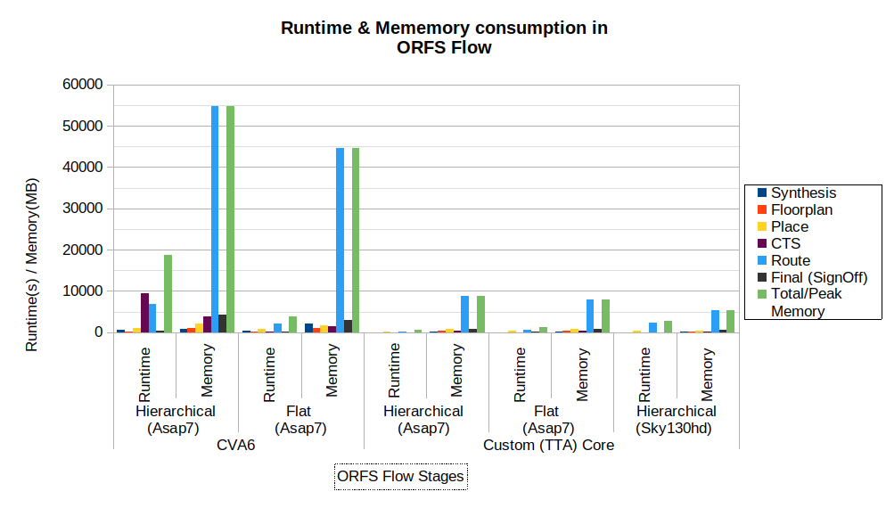

# Gap analysis

The section provides a gap analysis between the proprietary EDA software and open-source equivalents. It is divided into three major subsections, which embrace design domains and technologies. In general, the open-source landscape can be characterized as very dynamic and fragmented in the opposition of conservative and consolidated solutions offered by the vendors. Since 2020, when SKY130 PDK was released, the open-source tools have progressed substantially and follow a constant growth trend. Many existing gaps have been filled, and many are in the development phase. Thus, this document is a snapshot of the landscape now (Q4, 2025). The detailed comparison applies also to the technology nodes, which were released to the open-source domain: SKY130, GF180, IHP-SG13G2, ICSprout55. Since only using these nodes, it is feasible to perform a full design process.

## Digital

Designing digital ICs with open-source tools has become a viable option in recent years, as there are relatively mature system level modeling simulators and emulators that are used in both academia and industry. Recent years have seen growing interest in logic synthesis and physical design, and open-source tools have evolved rapidly and have resulted in multiple chip tape-outs. The following provides a more detailed analysis of the digital design flow stages.

System Level Design

For system level modeling, there exist well-established and widely adopted open-source tools. Emulators (**QEMU**) allow running operating systems on a variety of target architectures, and functional simulation allows modeling of platforms and peripherals (R**enod**e) as well as microarchitectural details of components (**gem5**) in system level simulations.

Recent years have seen increasing adoption of open-source RISC-V processor cores into commercial designs. They have been implemented as host cores capable of running linux-based operating systems, as well as accelerators by adding customized hardware for specific tasks. Currently there exist multiple open-source toolsets that can be used to design, customize, generate HDL, and compile programs for RISC-V based cores.

HLS Tools

Existing open-source high-level synthesis tools (**Bambu, CIRCT, Dynamatic**) that convert high-level program descriptions to RTL implement most of the necessary features to generate hardware circuits of sufficient complexity. The largest gap between the commercial and the current open-source HLS tooling relates to the extent of the commercial IP libraries, verification support and integration of HLS-generated designs to the rest of the development ecosystem. To help the open-source HLS projects to catch up to the commercial tooling, the effort should be focused on the maintainable long-term development of open-source tooling. This enables the accumulation of development effort in the open-source ecosystem, instead of being split among independent projects.

Current actively maintained open-source HLS tools work with either (pragma-assisted) C/C++ input languages or custom HLS-domain-specific languages (**SystemC, DSLX**). In terms of input languages, the current HLS tools can be improved to support parallel programming models to conveniently describe parallel accelerators. Support for portable heterogeneous programming models based on open standards such as **OpenCL** or **SYCL** within an open-source HLS tool could enable end-to-end acceleration flows for FPGAs while also serving as a portable input to an ASIC-synthesis flow. This would also enable system-level simulations and verification to be performed early using portable OpenCL applications.

Logic Design and Synthesis (Frontend)

Open-source synthesis tools have become a viable option in recent years for implementing digital ICs. There are multiple frameworks using **Yosys**, which has become the open-source de facto synthesis tool. Although capable of producing valid synthesis results, it has limitations regarding optimizations and supporting testability. A gap in the tool is the lack of timing-driven synthesis, as the tool does not aim to optimize design timing.

To enable large-scale chip production testing, DFT tools should be developed further. While **Yosys** lacks capabilities for DFT insertion, there are experimental tools being developed that aim to address this gap. **Difetto** enables scan chain and JTAG insertion as well as automatic test pattern generation but is currently confirmed to only work with SKY130. It is also missing advanced DFT features such as BIST IP insertion. A less significant gap in **Yosys** is the lack of support for VHDL or SystemVerilog packages.

By having frameworks or design flow managers such as **LibreLane** or **ORFS**, the open-source EDA tooling seems to have an advantage over commercial tooling, as the automated process can allow a lower barrier of entry into ASIC design. This can also potentially cut development time and costs.

Physical Design (Backend)

Recent years have also seen development of open-source tools for producing GDSII from RTL descriptions. Namely **OpenROAD** and **LibreLane** have been gaining attention as complete tool flows with automation capabilities for the full flow. Both frameworks have been used to successfully tape out designs. While we didn’t identify apparent gaps in terms of features in the tool flows, our hands-on experiments showed that they result in significantly larger area footprint on some designs when compared to commercial tooling. For the popular CVA6 core, the results produced by open-source and commercial tools were close to each other, but for a statically scheduled wide-issue DSP core the area footprint was significantly larger.

A limitation for adopting open-source tooling for implementing advanced devices can be the range of support for advanced commercial process nodes. **OpenROAD** lists support for the following proprietary nodes: GF55, 12nm, Intel22, Intel16 and TSMC65.

Result of RTL-to-GDSII Flow with ORFS (OpenROAD Flow Scripts)

To evaluate quality of results (QoR), the RTL-to-GDSII implementation of the CVA6 core from the **ORFS** example flow, along with a custom statically scheduled wide-issue DSP core generated using **OpenASIP** was performed using **ORFS**, an autonomous EDA flow built on the **OpenROAD** toolchain. Both designs were implemented using the **ASAP7** and **SkyWater 130 nm (sky130hd)** process design kits (PDKs) under identical design constraints with flat and hierarchical synthesis. The synthesis results from both open-source **ORFS** tools and commercial tools are shown in the following table.

**Table 4.1**. Synthesis Results.

| Design                                                                                                                                                                                 | CVA6      |                | Custom (TTA) Core |                |
|----------------------------------------------------------------------------------------------------------------------------------------------------------------------------------------|-----------|----------------|-------------------|----------------|
| Tool                                                                                                                                                                                   | **ORFS**  | **Commercial** | **ORFS**          | **Commercial** |
| Utilization (%)                                                                                                                                                                        | 72        | 70             | 76                | 70             |
| Area (µm²)                                                                                                                                                                             | 21746     | -8.3 %         | 2697              | -31.7 %        |
| Gate Equivalent (GE)                                                                                                                                                                   | ~ 249 KGE |                | ~ 31 KGE          |                |
| *GE refers to a unit of measure to specify manufacturing technology-independent complexity of digital circuits. It represents an area of a two-input NAND gate with minimum strength.* |           |                |                   |                |

Table 4.1 presents a comparison of synthesis results for area and gate counts obtained using ORFS and commercial tools. **ORFS** uses **Yosys** for synthesis. The synthesis results show that the area and gate count are higher in **ORFS** synthesis compared to commercial tool. For CVA6 core, the differences are relatively small. However, for custom TTA core, the commercial tool results in over 30 % smaller area.

Table 4.2 lists the runtime and memory consumption at various stages of **ORFS** flow with both hierarchical and flat implantation in **ASAP7** and **sky130hd** technology nodes.

**Table 4.2**. ORFS Flow Results.

|                             |                             |                     |               |               |           |         |           |                    |                                 |
|-----------------------------|-----------------------------|---------------------|---------------|---------------|-----------|---------|-----------|--------------------|---------------------------------|
| Design                      | **Synthesis Imp.**          | **Runtime/ Memory** | **Synthesis** | **Floorplan** | **Place** | **CTS** | **Route** | **Final /Signoff** | **Total Runtime / Peak Memory** |
| CVA6                        | **Hierarchical (ASAP7)**    | **Runtime (s)**     | 713           | 224           | 1040      | 947     | 6911      | 386                | 18744                           |
|                             |                             | **Memory (MB)**     | 914           | 1134          | 2080      | 3919    | 54780     | 4308               | 54780                           |
|                             | **Flat (ASAP7)**            | **Runtime (s)**     | 389           | 217           | 714       | 243     | 2092      | 252                | 3909                            |
|                             |                             | **Memory (MB)**     | 2220          | 1010          | 1679      | 1402    | 44597     | 3074               | 44597                           |
| Custom (TTA) Core           | **Hierarchical (ASAP7)**    | **Runtime (s)**     | 33            | 29            | 234       | 38      | 236       | 67                 | 637                             |
|                             |                             | **Memory**          | **192**       | **293**       | **880**   | **394** | **8844**  | **759**            | 8844                            |
|                             | **Flat (Asap7)**            | **Runtime (s)**     | **14**        | **14**        | **320**   | **19**  | **708**   | **110**            | 1185                            |
|                             |                             | **Memory (MB)**     | **204**       | **310**       | **767**   | **427** | **7901**  | **779**            | 7901                            |
|                             | **Hierarchical (Sky130hd)** | **Runtime (s)**     | **53**        | **14**        | **286**   | **49**  | **2234**  | **49**             | 268                             |
|                             |                             | **Memory (MB)**     | **110**       | **230**       | **435**   | **279** | **5274**  | **661**            | 5274                            |
| *Unit of time (s) = Second* |                             |                     |               |               |           |         |           |                    |                                 |

Figure 4 shown below shows the runtime and memory consumption at various stages of the **OpenROAD** flow. Based on the obtained ORFS flow results from running the flow for both designs across both technology nodes, with various configurations and synthesis implementation, it can be observed that the routing stages have the highest runtime and memory consumption. Additionally, hierarchical implementations exhibit higher runtime and memory usage compared to non-hierarchical implementations for the same design. The figure also indicates slightly increased runtime and memory consumption during the clock tree synthesis (CTS) in hierarchical implementations of the CVA6 design. However, noticeable such results were not observed during CTS in the custom TTA core as its design size is comparatively small.

Figure 4. Runtime and memory consumption in ORFS Flow at various stages.

The primary goal was to identify gaps in tool performance, functionality, and efficiency compared to commercial EDA tools, supporting a structured gap analysis. Physical design flow experiments evaluated QoR metrics, including timing, area, and power, alongside runtime and memory consumption, providing insights into the computational efficiency, resource utilization, and scalability of **ORFS** for both CVA6 and custom DSP designs across different technology nodes. The flow was executed using both earlier and more recent versions of the **OpenROAD** flow scripts. It was observed that the later versions improved design area and tool efficiency compared to previous runs. However, despite these improvements and promising future, there remain some limitations and areas for further improvements in the ORFS flow, including:

- Supports Verilog only, limited support for SystemVerilog and VHDL designs via plugins.

- Synthesis results, such as cell count and area, are worse compared to commercial EDA tools.

- Unable to target a specific clock frequency by adjusting the area accordingly.

- Provides limited control over the ORFS flow. In addition to that, for example, if fixes are required during detailed routing, the flow cannot be resumed from that stage and must be rerun from the beginning.

- Incremental adjustments between the flow stages, especially during later stages, are not supported, since most of the issues encountered were during routing stage due to congestion issues.

- Runtime and memory usage increase significantly with even slight increases in design complexity, particularly during the routing stage.

- Compared to commercial EDA tools, the GUI functionality is limited. The GUI does not support interactive component placement or other edits required for error fixing. All such actions must be performed through the Tcl command window of GUI.

- Congestion issues were observed during detailed routing for some designs, although some improvements were observed in later versions of **ORFS**.

- Possible limitations in terms of reliability of formal verification, DRC, ERC checks, and other physical verification which might require more testing.

Hence, it remains necessary to run designs of varying scales and types, applying different constraints and parameters, to conduct a detailed analysis of the **ORF**S flow. Preliminary results indicate that constant updates show some improvements in the tool. However, there still exist various limitations compared to commercial EDA tools.

Result of DFT in OpenROAD

**OpenROAD** currently supports only scan chain insertion as part of DFT. It does not generate test vectors (ATPG) or implement other DFT features such as MBIST, JTAG macros, boundary scan, or scan-chain compression. Implementation of these DFT features including ATPG, scan chain testing, MBIST/LBIST, JTAG macros, boundary scan, and scan-chain compression need to be performed using a separate DFT tool, such as **FAULT.**

## Analog/Mixed Signal/RF

Since analog, mixed-signal, and RF designs do not depend that much on the performance of the tools but rather on the functionalities available and on the quality of the results, the approach presented in this section differs from the previous one. The analysis to be presented below is descriptive, focusing on these two aspects: the capabilities offered by the tools and the accuracy and reliability of the design outcomes.

The gap analysis will be divided into the following subsections as in previous chapters.

Analog and Mixed-Signal design

In the open-source domain, the analog design flow is largely a **manual, feed-forward process**, lacking a central management component such as a library manager or an open-access design database, which are commonly available in commercial toolchains. Consequently, the responsibility for managing multiple design views and their respective states is delegated to the user, requiring a high level of awareness and discipline from the designer.

The flow consists of a set of loosely coupled tools that are largely interchangeable, as data exchange is based on standardized file formats such as **SPICE netlists** and **GDSII** layout files. Design data are typically stored in **human-readable ASCII formats**, which facilitates transparency, inspection, and, when necessary, manual manipulation of the design information.

Schematic capture tools use their own proprietary symbol formats, which are generally not interchangeable. The schematic views themselves are also not yet portable between different schematic editors, whether proprietary or open source.

**Xschem** provides a highly customizable and lightweight schematic editor capable of handling hierarchical designs, generating multiple netlist formats, invoking various simulation tools, and displaying simulation results within a single integrated interface. Its look and workflow are similar to **Cadence Virtuoso**, allowing users to migrate from proprietary environments to benefit from familiar key bindings and interaction paradigms.

The main challenge arises from the combination of a graphical interface with a text-based configuration environment, primarily based on **Tcl**. While this approach is powerful and flexible for experienced users, it may be confusing for newcomers. However, a comparable learning curve exists in proprietary tools, where inexperienced designers are often confronted with complex menus and extensive configuration options.

**Xschem** demonstrates active development and is supported by high-quality documentation. Since its early adoption as the primary schematic editor in the open-source silicon ecosystem, it has been integrated into all major open-source PDKs. Finally, the absence of a common design database and associated synchronization mechanisms prevent **back-annotation** of changes introduced at different stages of the design flow, such as layout editing or parasitic extraction.

**Qucs** – is an open-source electronic circuit simulator. It allows users to design and simulate analog, digital, and mixed-signal circuits using a graphical interface. QUCS includes a schematic capture tool, a simulation backend, and various analysis types such as DC, AC, transient, and S-parameter simulations. It uses its own solver (not SPICE-based) and was the predecessor to **Qucs-S**, which later added SPICE compatibility. The project is targeting Verilog-A netlist and using gnucap for simulation.

**XIC Tools** is a graphical editor and design suite that provides both schematic capture and mask layout capabilities. The key advantage of this toolset is its **multi-platform support**, as it runs on **Windows, macOS, and Linux** systems. Moreover, the entire design process can be carried out within a single, unified graphical user interface. Since these tools were originally developed as proprietary software and have only recently been released into the public domain, they have not yet been thoroughly evaluated by the open-source community. Nevertheless, extensive documentation is available, and the tools offer a degree of compatibility with **OpenAccess** database formats.

**Revolution EDA** – Revolution EDA offers symbol, schematic and layout editors for integrated circuit design. It is free to use and source-code is open to use and modify (but not to sell further). Revolution EDA is rapidly developed thanks to extensive Python libraries. The project claims to release an analogue design environment that will target the Xyce simulator. Although the code is visible on the github the software is redistributed under Common Clause 1.0 license which is not open-source compatible. The software is under development.

Simulators

Since circuit simulation is one of the most critical stages of the design process, the availability of robust simulator functionality, support for industry-grade device models, and the accuracy of simulation results are of paramount importance. As summarized in the previous section, five open-source simulators collectively provide the majority of features required for analog circuit design. However, in contrast to proprietary environments, open-source toolchains generally lack higher-level abstractions for simulation setup, simulator invocation, and automated analysis of simulation results.

In recent years, open-source simulators have added support for device models written in **Verilog-A/AMS**, making model handling a critical aspect of the simulation process. Proprietary tools typically provide built-in mechanisms for parsing model cards and sweeping parameter values. The evolution of industry standards has introduced domain-specific modeling languages such as **Verilog-A** and **Verilog-AMS**, enabling designers and foundries to describe device and circuit behavior in a programmable and standardized form.

Because proprietary simulators are closed-source, they natively support these standardized languages. In contrast, open-source simulators have adopted a different approach: developers have focused on exposing built-in models to users and enabling code-based models through extensions such as **XSPICE**, or via model generators such as **OpenVAF,** **ADMS** and **GnucapModelGen**. These tools translate Verilog-A source code into binary data compiled and linked with the simulator.

More recently, **Ngspice** and **VACASK** introduced a standardized communication mechanism between simulators and external models through the **Open Source Device Interface (OSDI)**. VACASK is designed around the concept of implementing all device models directly in Verilog-A and relying on OSDI for simulator–model interaction. To further bridge the gap between Verilog-A and open-source simulators, an open-source Verilog-A compiler, **OPENVAF**, is currently under development.

**Verilog A** compliance in **OPENVAF** – according to the developers, the subset of the standard that is used by compact models (and more) is already implemented. The project delivers also some extra features not covered in Verilog-A standard.

Below is a list of **Verilog AMS** features not yet covered by gnucap-mg-gen:

**(final_step), (absdelta), (noise_table, noise_table_log), (\$display), (\$monitor), (\$stop), (\$fatal), (\$warning), (\$error), (\$info), (\$realtime), (\$stime), (\$random), (\$arandom), (\$simparam\$str), (\$simprobe), (\$xposition), (\$yposition), (\$angle), (\$hflip), (\$vflip)** but under development.

Also, not all primitive devices are covered.

To summarize, the landscape for simulators and model support is fragmented but evolving. The comparative analysis of the simulators shows that a few of the advanced analyses are not yet supported or are being developed. Also support for statistical modeling of the circuit is something that can be done using some coding overhead. At the operational level, the simulators are very similar but not fully compatible. There are a few differences in the syntax, especially when setting up the simulations. Also, the model cards used by proprietary simulators are not identical but roughly 90% compatible with the open-source equivalents. Once the model translation is finished, the quality of results is in general very good for the available analysis. Introduction of OPENVAF Verilog-A compiler homogenizes the modeling part and permits us to use industry grade complex models. In terms of productivity, the open-source solutions lack of an integrated development environment (IDE) editor for Verilog AMS or any other mixed-signal HDL. This type of tool would help to code models more efficiently, avoid syntax errors and debug their compilation as shared libraries to be used in mixed-signal simulations.

An important difference between proprietary simulation software and open-source equivalents is the user interface. Licensed software sets up simulations and runs the simulator in the background, allowing users to view and manipulate results through the front-end interface. In the open-source domain, this process is usually much closer to the user (involving netlist operations, textual setup of simulations, and third-party tools for data post-processing). On one hand, this makes it more complex, but on the other hand, it offers greater flexibility and plenty of room for customization. A particular open-source functionality that is commonly missing in the mixed-signal design methodology is the automatic partitioning of the design between analog and digital domains, which would speed up the netlisting process. In principle, this functionality could be easily implemented by the possibility of specifying netlisting rules by the user, like cell view priorities.

Layout drawing and PyCell support

This part of the flow is quite well covered by existing tools. Recent advances in KLayout made it possible to use PyCellStudio compatible Python code to generate the layout objects. Also, the tendency to use Python language makes this step of design versatile and speed up the development process. The gap between the proprietary software is the integration with other design steps to provide data exchange and synchronization between schematic editor, EM simulator.

DRC

Here, similarly, on the proprietary side the generic DRC rules are implemented using tool-specific format, which is an inoptimal solution. Since DRC checks can be computationally exhaustive, the performance of DRC engine matters and depends on the implementation. In KLayout the DRC rules are typically implemented using ruby language and executed using a built-in ruby interpreter.

LVS

Open-source LVS verification shares the same problems as DRC: lack of unification and performance issues. Additionally, in some cases LVS is performed in two steps using different standalone tools: magic for netlist extraction and netgen for netlist comparison.

PEX

In the analog domain PEX extraction is still at very early stage. It is possible to extract a netlist with annotated parasitics out from the layout. However, the built-in algorithms behind these solutions are rudimentary and to not consider more complex capacitive and resistive parasitic coupling. There are other tools like FastCap, FasterCap and FastHenry, which can extract capacitance from a given geometry. The last option are the EM solvers, which use computationally intensive complex method to identify scattering parameters of an element which can lead to elements value identification. The ecosystem lacks integration at each level and the quality of results has not been verified extensively.

RF design

The part of the open-source ecosystem which relates to the RF design suffers from fragmentation and currently it is a first approximation to build a flow for RF design based on existing tools, which support to some extent the features needed to design a microwave circuit. As in the previous examples, integration is the key to solving the problem.

One common gap in using EM simulation results with open-source workflows is the use of S-parameters. Simulators typically don’t support SnP data blocks (frequency domain data) for large signal/transient simulation. Convolution methods that are used in commercial circuit simulators to solve this are not yet available.

Commercial simulator frameworks often provide some “Broad Band SPICE” extraction to convert S-Parameters to a SPICE model that is valid for wideband and well behaved (passive, causal). The current state of the open-source ecosystem can support this approach.

Another pitfall is the lack, or poor quality of results, of some simulation types like phase noise, transient noise, harmonic balance, periodic steady state.

Commercial frameworks like ADS provide geometry preprocessing to make layouts more “simulator friendly” before sending them to EM. This reduces complexity without losing important details, to simulate faster or make simulation possible at all. Such geometry preprocessing is certainly possible using KLayout plus possibly some external code, but this is not implemented today. The present IHP EM workflows for openEMS and Palace are based on GDSII layouts. They can be extended to multi-chip simulation, from multiple GDSII data sources, but do not support additional 3D features like bond wires, dielectric lenses or hollow waveguides.

## Integrated Photonics

In PIC design, the open-source tools cover current existing needs quite well. This covers electro-magnetic device level simulations, linear circuit simulations, and layout.

However, as the domain becomes more mature, more advanced simulations and techniques will be needed: cross-talk extraction, post-layout simulation, etc., and there are currently no open-source tools dedicated to PICs.

Another problem of the ecosystem is fragmentation of the tools. There are no environments which offer seamless connection between various design steps, and manual effort is required to make sure the tools work together in a coherent design flow. Standardizing the input / output data formats could be helpful.

Taking into account large variety of tools and technologies in integrated photonics, there is a scalability problem of how foundry data propagates to software-specific PDKs. This problem is relevant for both commercial and open-source tools. In our view, this is where open-source community can create a unique approach, specifically, by defining and using open standards for the data to be provided by foundries (building block layout, performance, technology info, and design rules) and later compiled into software PDKs.

Device simulations

There are several high-quality open-source tools for EM simulation implementing various simulation methods. The main gap is that each tool provides its own method, and there are no environments where multiple methods can be employed or their results linked together. Therefore, integrating these tools together would be helpful for device design. Availability and ease of using open source PDKs can also be improved.

Circuit simulations

Linear simulations are somewhat comparable to existing commercial tools. When simulating active components, there is a lack of tools taking into account non-linear effects. This is a difficult problem, which was solved (or is being addressed) by several commercial tools, but the open-source solutions are lacking in this regard. Also, capabilities to do circuit variation analysis should be improved.

Layout tools

Open-source tools enable high quality layout with many useful features such as parametric component definition, hierarchical design, high speed rendering. This requires, however, manual layout scripting and some proficiency with coding. Commercial tools allow automatic layout generation from schematic.

Some advanced features such as auto-routing are not very mature. Drag-and-drop approach and bidirectional synchronization of schematic and layout (script) are only available in commercial software tools.

Physical verification

DRC checks in KLayout are a powerful tool allowing quite sophisticated mask-level checks. The DRC execution time on large circuits (e.g. on wafer scale) with curved paths containing many points may not be optimal compared to the commercial tools. The DRC decks for a given technology are described in the dedicated tool-specific language, which therefore requires double effort when creating rule decks for different tools.
