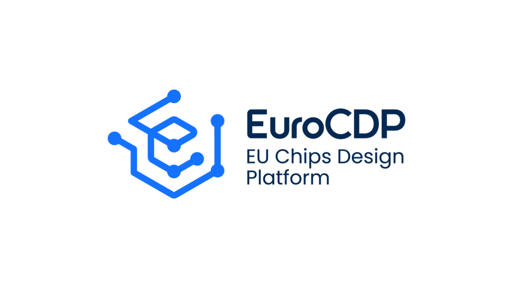

Open EDA Tool Gap Analysis and Recommendations for EuroCDP

**Authors:** Joonas Multanen (TAU), Laxmi Karkee (TAU), Pekka Jääskeläinen (TAU), Macarena Martínez-Rodríguez (IMSE-CNM-CSIC), Dzmitry Pustakhod (TUE), Krzystof Herman (IHP), Diego Gigena-Ivanovich (SAL), Emanuele Bottino (SAL), Francesc Serra-Graells (IMB-CNM-CSIC), Caaliph Andriamisaina (CEA)

**Abstract:** This document provides recommendations for open-source EDA tools for design flows in the following domains: Digital, photonics, analog & mixed-signal and radio frequency. The document also describes a gap analysis to identify the state of the open-source software in comparison to commercial tools.

Disclaimer** **

The information, documentation and figures available in this deliverable are written by the "DECIDE: Democratizing European Chip Innovation and Design Ecosystem”, from now on referred as EuroCDP, project’s consortium under EC grant agreement 101218811, and do not necessarily reflect the views of the European Commission. 

The European Commission is not liable for any use that may be made of the information contained herein. 

Copyright notice 

© 2025 EuroCDP

Executive Summary

This document provides an overview of open-source EDA tooling status in the domains of digital, analog, mixed signal, radio frequency (RF) and photonics design. A typical flow in each domain is first described, after which existing open-source tools are listed and comparisons of their features are presented. An analysis pointing out the major gaps between open-source and commercial tools is presented, and finally, indicative recommendations on tools to use are proposed.

The goal is to provide designers with guidelines on the capabilities of open-source EDA tools compared to existing proprietary solutions. This should help designers decide whether open-source EDA tools are appropriate for their projects. On the other hand, the gap analysis should provide recommendations for improving the open-source EDA tool chain.

Since 2020, designers have had the option to tape out designs with open process design kits (PDK), where the process technology information is openly available. Today there are three manufacturers (of which one is based in the EU) offering manufacturable open PDKs. Currently, up to 130 nm process nodes are offered.

The maturity of the different design flows varies. Digital design tools seem to have been developed enthusiastically by the community in recent years, making it the most mature of the analyzed flows. While there aren’t apparent gaps that would prevent producing functioning chips with open-source tools, there is room to improve the support for advanced process nodes and features such as design for test (DFT). Hands-on experimentation revealed that design timing and area consumption produced by open-source physical design tools varies: In one design case the produced results were on par with commercial tools, whereas another case resulted in notably worse results.

In the analog design flow, there is currently a toolchain available which allows analog IC design based on an open PDK. In contrast, for mixed signal design, major gaps still exist, with no clearly established de facto tools. These gaps include insufficient support for advanced analysis capabilities, as well as usability and performance issues of the simulators.

The open-source RF design ecosystem is quite young and adapts previously existing EDA tools for its purposes. Many capabilities found in commercial software are yet to be implemented in open-source tools, but there seems to be continuous development in this domain.

In the photonics flow, the open-source script-based tooling supports the layout implementation quite well. The integration of these tools with schematic editors and circuit-simulators is missing: Currently, there are no open-source design environments to connect the different design steps and tools. In the future, there is a need to enable this to cover more advanced use cases. Another area to improve is the standardization of file formats and interfaces between the tools.

Table of Contents

- [1. Design Flows](design-flows.md#design-flows)
- [1.1. Digital Design](design-flows.md#digital-design)
- [1.1.1. System Level Design](design-flows.md#system-level-design)
- [1.1.2. Logic Design and Synthesis (Front-End)](design-flows.md#logic-design-and-synthesis-front-end)
- [1.1.3. Verification, Testing, Power and Timing Analysis](design-flows.md#verification-testing-power-and-timing-analysis)
- [1.1.4. Physical Design (Back-End)](design-flows.md#physical-design-back-end)
- [1.2. Analog/Mixed Signal/RF](design-flows.md#analogmixed-signalrf)
- [1.2.1. Analog design](design-flows.md#analog-design)
- [1.2.2. Mixed-signal design](design-flows.md#mixed-signal-design)
- [1.2.3. RF design](design-flows.md#rf-design)
- [1.3. Integrated Photonics](design-flows.md#integrated-photonics)
- [1.3.1. Conceptual design](design-flows.md#conceptual-design)
- [1.3.2. Block-level design](design-flows.md#block-level-design)
- [1.3.3. Circuit simulation and layout](design-flows.md#circuit-simulation-and-layout)
- [1.3.4. Physical layout verification](design-flows.md#physical-layout-verification)

- [2. Open-Source EDA Tools](open-source-eda-tools.md#open-source-eda-tools)
- [2.1. Open-Source-Related Considerations](open-source-eda-tools.md#open-source-related-considerations)
- [2.2. Digital](open-source-eda-tools.md#digital)
- [2.2.1. Tool descriptions](open-source-eda-tools.md#tool-descriptions)
- [2.2.2. Feature comparison](open-source-eda-tools.md#feature-comparison)
- [2.3. Analog/Mixed Signal/RF](open-source-eda-tools.md#analogmixed-signalrf)
- [2.3.1. Tool descriptions](open-source-eda-tools.md#tool-descriptions-1)
- [2.3.2. Feature comparison](open-source-eda-tools.md#feature-comparison-1)
- [2.4. Integrated photonics](open-source-eda-tools.md#integrated-photonics)
- [2.4.1. Tool descriptions](open-source-eda-tools.md#tool-descriptions-2)
- [2.4.2. Feature comparison](open-source-eda-tools.md#feature-comparison-2)

- [3. Process design kits](process-design-kits.md#process-design-kits)

- [4. Gap analysis](gap-analysis.md#gap-analysis)
- [4.1. Digital](gap-analysis.md#digital)
- [4.2. Analog/Mixed Signal/RF](gap-analysis.md#analogmixed-signalrf)
- [4.3. Integrated Photonics](gap-analysis.md#integrated-photonics)

- [5. Tool Recommendations](tool-recommendations.md#tool-recommendations)
- [5.1. Digital](tool-recommendations.md#digital)
- [5.2. Analog/Mixed Signal/RF](tool-recommendations.md#analogmixed-signalrf)
- [5.2.1. Analog Design](tool-recommendations.md#analog-design)
- [5.2.2. Mixed-Signal Design](tool-recommendations.md#mixed-signal-design)
- [5.2.3. Radio Frequency Design](tool-recommendations.md#radio-frequency-design)
- [5.3. Integrated Photonics](tool-recommendations.md#integrated-photonics)

- [6. Conclusions](conclusions.md#conclusions)
- [6.1. Outlook](conclusions.md#outlook)

Glossary

| Definition                                     | Abbreviation |
|------------------------------------------------|--------------|
| Assembly Design Kit                            | **ADK**      |
| Application Specific Integrated Circuit        | **ASIC**     |
| Application Specific Instruction set Processor | **ASIP**     |
| Clock Tree Synthesis                           | **CTS**      |
| Design For Testing                             | **DFT**      |
| Design Rule Check                              | **DRC**      |
| Electronic Design Automation                   | **EDA**      |
| EigenMode Expansion                            | **EME**      |
| Hardware Description Language                  | **HDL**      |
| Integrated Circuit                             | **IC**       |
| Instruction Set Architecture                   | **ISA**      |
| Layout versus Schematic                        | **LVS**      |
| Photonic Integrated Circuit                    | **PIC**      |
| Power, Performance and Area                    | **PPA**      |
| Process Design Kit                             | **PDK**      |
| Process, Voltage, Temperature                  | **PVT**      |
| Quality of Results                             | **QoR**      |
| Register Transfer Level                        | **RTL**      |
| Rigorous Coupled Wave Analysis                 | **RCWA**     |
| System Verilog                                 | **SV**       |
| Test Design Kit                                | **TDK**      |
| Transaction Level Modeling                     | **TLM**      |
| Transfer Matrix Method                         | **TMM**      |
| Universal Verification Methodology             | **UVM**      |
